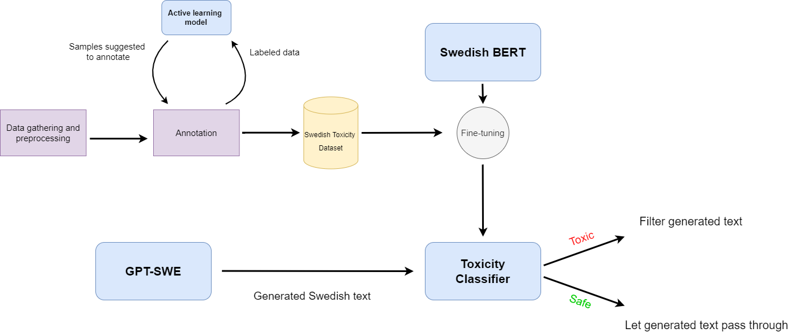

# SweToxicityClassifier
A project where the goal was to create a Swedish toxicity classifier aimed to filter the output of the Swedish language model GPT-SWE. The project involved data gathering, pre-processing and annotation to create a Swedish dataset. This dataset was then used to fine-tune several Swedish BERT models to create toxicity classifiers.

